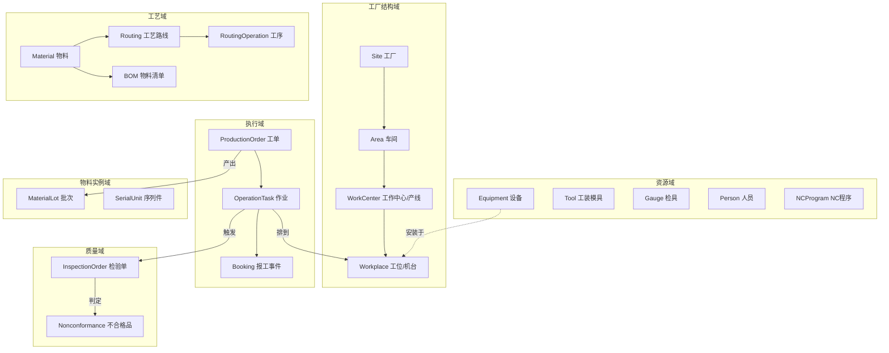

# 02 车间对象模型（核心领域模型）

> 本文档是全部功能模块的共同基础。模型参照 IEC 62264（ISA-95）的资源模型与 MPDV MIP 平台 ViPR（虚拟生产现实）的 MBO（Manufacturing Business Object）思想：**人员（Personnel）、设备（Equipment）、物料（Material）、工艺段（Process Segment）四类资源 + 运营定义/排程/执行/绩效四类信息**，并针对离散车间做工程化裁剪。
>
> 按 MIP 的 ViPR 数据组织方式，每类对象的数据分三层（见《MPDV Product Specification》MIP-RES/MAT/WO/QP 各包的共同结构）：
> 1. **Events（事件）**——现场发生的不可变记录；
> 2. **Online Projection（在线投影）**——由事件推导的对象当前状态（当前设备状态、作业进度、库存余额）；
> 3. **Results（结果记录）**——按班次/订单等口径结算的可签核结果（产量结果、状态时长结果、个人工时结果），结果记录可修正并生成冲销记录。
>
> xmes 的所有执行类对象遵循同一三层结构，这是报工修正、ERP 回传冲销、KPI 重算等需求的模型基础。
>
> 命名约定：实体名用英文（与未来代码一致），中文为业务名称。`*` 表示业务主键（编码），所有实体默认含 `id、tenant_id、创建/更新审计字段、逻辑删除`，不再重复列出。

## 1. 模型总览



对象分为六个域：**工厂结构、资源、工艺（运营定义）、计划与执行、物料实例与追溯、质量**，另有贯穿性的**事件与日历**模型。

---

## 2. 工厂结构域（参照 ISA-95 Equipment Hierarchy）

### 2.1 层级模型

```
Enterprise(企业=租户) → Site(工厂) → Area(车间) → WorkCenter(工作中心) → Workplace(工位/机台)
```

| 实体 | 业务名 | 关键属性 | 说明 |
| --- | --- | --- | --- |
| `Site` | 工厂 | *编码、名称、地址、时区、默认日历 | 租户下可多工厂 |
| `Area` | 车间 | *编码、名称、所属 Site | 数据权限的常用粒度 |
| `WorkCenter` | 工作中心 / 产线 | *编码、名称、类型（产线/设备组/班组/外协）、所属 Area、日历、产能模型（单机/并行机台数） | **排程的产能单位**；ERP 工艺中的工作中心与此对应 |
| `Workplace` | 工位 / 机台 | *编码、名称、所属 WorkCenter、类型（机加/装配/检验/返修/外协虚拟）、是否需登录上岗、绑定终端、默认采集通道 | **执行与数采的最小单位**，ISA-95 Work Unit |
| `MaterialBuffer` | 物料缓存区（库位） | *编码、名称、所属 Area/Workplace、类型（线边库/缓冲区/不合格隔离区/成品暂存）、按物料的库存上下限 | 车间内物流节点，对应 HYDRA MIM 的 Material Buffer：物理或组织性的存放结构 |
| `TransportUnit` | 运输单元 | *编码、类型（托盘/料箱/周转笼…）、容量、当前位置、当前承载批次 | 对应 MIM 的 Transport Unit，包装/搬运的容器对象 |

规则：

- R2-1 层级不可跳级挂载；Workplace 必须属于唯一 WorkCenter。
- R2-2 WorkCenter 删除前须无未关闭作业；结构变更留历史版本（生效日期区间），历史报工的归属不随重组改变。
- R2-3 每个 Workplace 可定义**状态原因树**引用（见 §3.3）与**报工策略**（是否允许多人同时上岗、是否允许并行作业）。

### 2.2 班次与日历

| 实体 | 业务名 | 关键属性 |
| --- | --- | --- |
| `ShiftModel` | 班次模型 | *编码、名称、班段列表（早/中/晚，含跨天标志、休息段） |
| `Calendar` | 工厂日历 | *编码、按日期生效的班次模型、节假日、特殊加班日 |
| `ShiftInstance` | 班次实例 | 日期 + 班段在某 WorkCenter 上的具体落地（系统按日历自动生成，可单独调整） |

- R2-4 所有统计（OEE、产量、工时）以 **ShiftInstance** 为最小时间桶；跨天班次按班次归属日统计。
- R2-5 日历可按 Site 定义、按 WorkCenter/Workplace 覆盖。

---

## 3. 资源域

### 3.1 人员（Personnel）

| 实体 | 业务名 | 关键属性 | 说明 |
| --- | --- | --- | --- |
| `Person` | 人员 | *工号、姓名、所属组织、关联 pig 用户(可空)、卡号/工牌码（含**替代卡**临时挂失补办）、照片、自定义字段（车牌/急救培训…）、默认班组、**主数据版本**（同一人不同生效期多条记录） | 对应 WFO HR master：操作工可无系统账号，仅凭工牌在工位终端上岗；主数据变更留变更日志；访问受"责任区域"数据权限保护 |
| `PersonTimeAccount` | 个人时间账户 | 人员 × 账户（出勤/加班/年假等，支持多个时间/天账户）→ 余额 | 对应 WFO 的 account balances，余额可查可调（留痕） |
| `Team` | 班组 | *编码、名称、所属 WorkCenter、组长 | |
| `Qualification` | 资质定义 | *编码、名称、有效期策略、关联工序类型/设备类型 | 如"激光焊接上岗证" |
| `PersonQualification` | 人员资质 | 人员、资质、取得日期、有效期至、证书附件 | 过期自动失效 |
| `AttendanceRecord` | 出勤/工时记录 | 人员、班次实例、上岗/离岗时间、来源（刷卡/终端/手工） | 详见 07 |

### 3.2 设备（Equipment）

| 实体 | 业务名 | 关键属性 | 说明 |
| --- | --- | --- | --- |
| `EquipmentClass` | 设备类型 | *编码、名称、属性模板、默认状态原因树、默认采集点模板 | 如"CNC 加工中心" |
| `Equipment` | 设备台账 | *编码、名称、类型、序列号、厂商/型号、购置日期、安装 Workplace、关键性等级、采集通道配置、当前状态 | 设备与工位 1:1 或 N:1（一个工位多台辅机） |
| `EquipmentStatusRecord` | 设备状态记录 | 设备、状态、原因码、开始/结束时间、来源（自动/人工）、关联作业 | 不可变区间记录，OEE 的数据基础 |
| `EquipmentCounter` | 设备计数器 | 设备、计数类型（产量/行程/能耗）、累计值、采集时间 | 自动报工与保养触发依据 |
| `DataTag` | 采集点 | *编码、设备、协议地址、数据类型、单位、采集周期、是否过程参数、是否虚拟点（由逻辑模块表达式计算） | MES 维护对象主数据，由后期物联网模块消费执行采集（决策 Q6）；虚拟点对应 DEC 逻辑模块预处理能力 |
| `StatusClass` | 状态类 | *编码、名称、OEE 时间归类 | 对应 MMO 的 Status Class：将设备状态归类到时间账户 |
| `TimeAccount` | 时间/绩效账户（RPA） | *编码、名称、类型（调机/生产/各类故障/等待/人员出勤…） | 对应 HYDRA 的 Resource Performance Account：生产时长、停机时长、人员工时按账户归集，供报表与 ERP 上传 |

### 3.3 设备状态机（统一状态模型）

一级状态全局统一（参照 VDMA/OEE 口径），二级原因按设备类型配置为**原因树**：

```
一级状态：  RUN 运行 │ IDLE 待机 │ SETUP 调机 │ DOWN 故障 │ MAINT 维护 │ OFF 停机(计划外用)
                            │
二级原因树（示例，可配置）：  DOWN ─ 机械故障 ─ 主轴异常
                                  ├ 电气故障
                                  └ 等待维修
                            IDLE ─ 缺料 / 缺人 / 缺程序 / 等质检
```

- R3-1 任意时刻设备有且仅有一个一级状态；状态记录首尾相接、不重叠（区间模型）。设备类型可按需配置**复杂/并行状态**（如"运行中带降速报警"以主状态+标记表达）。
- R3-2 自动采集判定 RUN/IDLE/DOWN；人工只能在终端补充二级原因或在自动信号缺失时人工切换。状态切换有合理性校验（如：无作业登录时不允许置 SETUP 调机状态，对应 MMO 的 validation checks）。
- R3-3 状态通过 `StatusClass` 映射到 `TimeAccount`（时间账户）与 OEE 时间分类：计划生产时间 = 班次时间 − 计划停机(MAINT/OFF)；RUN 计入开动。状态时长按班次结算为**结果记录**（可人工修正并留冲销痕迹）。
- R3-3a 节拍模型：设备/工序维护目标节拍（cycle time）与每模/每循环件数（parts per cycle，注塑腔数等），用于自动计数折算产量、目标-实际节拍对比与性能开动率计算；作业登录时校验作业的每模件数与模具的每模件数一致（防错）。

### 3.4 工装模具 / 检具 / NC 程序

| 实体 | 业务名 | 关键属性 |
| --- | --- | --- |
| `Tool` | 工装/模具 | *编码、名称、类型、规格、寿命模型（总寿命/当前累计模次）、保养周期、当前状态（可用/保养中/维修/报废）、当前存放位置/装夹设备 |
| `ToolUsageRecord` | 模具使用记录 | 模具、设备、作业、上/下机时间、本次模次 |
| `Gauge` | 检具/计量器具 | *编码、名称、精度、校验周期、上次/下次校验日期、状态（合格/到期/停用）、存放位置 |
| `GaugeCalibration` | 检具校验记录 | 检具、校验日期、结果、证书附件 |
| `NCProgram` | NC 程序 | *程序号、名称、适用物料+工序+设备类型、版本、状态（草稿/审核/发布/冻结）、文件 |

- R3-4 模具累计模次由报工数量或设备计数器自动累加；达保养阈值自动生成保养任务并可配置"禁止上机"。
- R3-5 检具过期后，引用该检具的检验单不允许录入结果（可配置为警告）。
- R3-6 NC 程序按"物料+工序+设备"三元组匹配下发，版本不符时终端告警（防错）。

---

## 4. 工艺域（运营定义，Operations Definition）

| 实体 | 业务名 | 关键属性 | 说明 |
| --- | --- | --- | --- |
| `Material` | 物料 | *编码、名称、类型（原料/半成品/成品/辅料）、单位、**批次管理策略（不管批/批次/序列号，按物料配置；成品可配置启用一物一码）**、默认检验策略、保质期 | 主数据，**以 MES 维护为主**（已确认决策 Q2/Q3），可选同步自 ERP |
| `MaterialUnit` | 单位与换算 | 物料、单位、换算率 | 支持双单位（件/kg） |
| `BOM` | 物料清单 | *（父物料+版本）、生效期、行：子物料、用量、损耗率、**消耗工序**（指向 RoutingOperation）、是否关键件（需扫码绑定） | 制造 BOM，按工序挂料 |
| `Routing` | 工作计划/工艺路线 | *（物料+版本）、状态（草稿/发布/冻结）、生效期、适用维度（订单类型/物料类型/批量区间） | 对应 HYDRA WOM 的 Work Plan：**MES 内维护为主**（决策 Q2）；同一物料可按订单类型/批量维护多个工作计划；支持**从工作计划生成工单** |
| `RoutingOperation` | 工序 | 路线、*工序号、名称、类型（加工/装配/检验/外协/返修）、默认 WorkCenter、标准时间（准备/单件/等待）、报工方式（按件/按时/里程碑）、是否质量门、并行/替代工序组、转移批量、所需资质、所需工装类型、文档（SOP）、参数模板 | 排程与报工的工艺依据 |
| `OperationParameter` | 工艺参数模板 | 工序、参数名、目标值、上下限、单位、是否强制采集 | 过程参数防错与 SPC 数据源 |
| `ProcessSegment` | 工艺段 | 跨物料复用的标准工序片段 | P1：支持工序引用标准段 |
| `ProductionVariant` | 生产变体 | 物料 × 模具/工装 × 设备 的允许组合及优先级 | 对应 FEDRA IVP：排程与开工时校验"该物料能否用该模具在该设备生产"，并辅助识别工装 |
| `SetupMatrix` | 换型矩阵 | 工作中心、换型维度（模具/颜色/物料/产品）、自(值)→至(值)→换型时长 | 对应 FEDRA SOP：相邻作业的动态换型时间，替代 ERP 静态准备时间；排程换型优化的依据 |

- R4-1 Routing/BOM 均带版本与生效期；工单创建时**快照**当时版本（工单内冻结，见 §5）。
- R4-2 工序类型=检验 → 自动关联检验计划（见 §7）；类型=外协 → 走外协作业流程。
- R4-3 替代工序组：同组工序互为替代（如人工焊/机器人焊），排程时二选一。
- R4-4 质量门（Quality Gate）：标记为质量门的工序未合格放行前，后道工序禁止开工。

---

## 5. 计划与执行域（Operations Schedule / Performance）

### 5.1 实体

| 实体 | 业务名 | 关键属性 | 说明 |
| --- | --- | --- | --- |
| `ProductionOrder` | 工单 | *工单号、**类型（生产/返工/间接费用）**、来源（ERP/工作计划生成/手工）、物料、数量（计划/良品/废品/返工）、单位、计划起止、优先级、状态、ERP 单据引用、**工艺快照**（工作计划+BOM 版本）、订单网络（前后工单依赖）、销售订单/项目号（追溯用） | 订单类型对应 HYDRA WOM：production / rework / overhead cost order，间接费用单用于维修、5S 等非生产工时归集 |
| `OperationTask` | 作业 | 工单、*（工单+工序号）、引用工序快照、状态、计划/排程起止、排程 Workplace、数量（应做/良/废/返/在制）、前后置关系、拆分序号 | **排程、派工、报工的对象**；一道工序可拆分为多个作业（分机台/分批） |
| `Booking` | 报工事件 | 作业、类型（开工/暂停/恢复/完工/报数/冲销）、数量（良/废-原因码/返工-原因码/欠超交偏差原因）、人员、工位、设备、班次实例、发生时间、备注（作业特殊情况记录）、来源（终端/PDA/自动/接口/补录） | **不可变事件**（ViPR Events 层），冲销以负向事件实现 |
| `OperationResult` | 作业结果记录 | 作业 × 班次的结算结果：各数量账户、各时间账户时长、签核状态 | ViPR Results 层：由事件结算生成，可显示/编辑/**签核**；已上传 ERP 后的更正自动生成**冲销结果记录**（对应 WOE 的 cancellation result records） |
| `TimeTicket` | 工时票（个人结果记录） | 由 Booking 推导的人员×作业工时区间、激励标识等个人参数 | 对应 WOE-POE：计件/计时与激励工资的数据基础；多机台作业时按规则分摊个人工时 |
| `DispatchList` | 派工队列 | Workplace 上按序排列的作业引用 | 终端"我的任务"数据源 |

### 5.2 工单状态机

```
CREATED 已创建 ──► RELEASED 已下达 ──► IN_PROGRESS 执行中 ──► COMPLETED 已完工 ──► CLOSED 已关闭
     │                  │                   │  ▲                      │
     └── CANCELLED ◄────┘            HOLD 挂起 ┘ （可恢复）            └─ 关闭后仅允许查询
```

| 迁移 | 触发 | 守卫条件 |
| --- | --- | --- |
| CREATED→RELEASED | 计划员下达 / ERP 指令 | 工艺快照生成成功；物料/资质校验（可配置） |
| RELEASED→IN_PROGRESS | 首个作业开工（自动） | — |
| IN_PROGRESS→HOLD | 人工挂起 / 质量拦截 | 挂起原因必填；在制作业自动暂停 |
| IN_PROGRESS→COMPLETED | 末道作业完工 | 良品+废品 ≥ 计划数 ×完工容差（可配置欠交） |
| COMPLETED→CLOSED | 计划员/定时关闭 | 所有检验单关闭、不合格品处置完毕、数据回传 ERP 成功 |
| →CANCELLED | 人工取消 | 无已报工数量（有则须先冲销或改为短关） |

### 5.3 作业状态机

```
PENDING 待排 ─► SCHEDULED 已排程 ─► DISPATCHED 已派工 ─► SETUP 调机 ─► RUNNING 进行中
                                                            │            │
                                            PAUSED 暂停 ◄──┴────────────┤
                                                            ▼            ▼
                                                    COMPLETED 完工 ──► (质量门: 待放行/已放行)
```

- R5-1 数量守恒：作业的 良+废+返+在制 ≤ 上道完工良品数（首道 ≤ 工单计划数 × 超产容差）。
- R5-2 默认串行流转；工序可配置"允许重叠"（转移批量>0 时，上道完成转移批量即可开下道）。
- R5-3 返工：产生 `返工数量` 时按策略 ①本工序重做 ②生成返修作业（插入返修工序）③生成返修工单（关联原工单，追溯链保持）。
- R5-4 所有时间统计来自 Booking 事件对；事件乱序/漏报由"异常报工待办"闭环（见 03 文档 FR-ORD-3x）。
- R5-5 比例分摊（对应 WOE）：一台设备同时登录多个作业，或一个作业登录多台设备时，生产/停机/故障时长按规则**按比例分摊**到各作业；个人工时在多机操作时同样分摊（POE）。
- R5-6 作业可**锁定/放行**（lock/release）：被锁定的作业禁止登录报工（质量拦截、工程冻结等场景），对应 WOE 的 locking and releasing operations 与 DEC 的 production lock。
- R5-7 数量自动换算：报工数量按工序换算系数自动折算到其他单位并记入对应数量账户（双单位场景）。

---

## 6. 物料实例与追溯域

| 实体 | 业务名 | 关键属性 | 说明 |
| --- | --- | --- | --- |
| `MaterialLot` | 批次 | *批次号、物料、数量、状态（待检/合格/不合格/隔离/冻结/耗尽）、来源（采购收货/生产产出/拆分）、生产工单、供应商批次、生产/失效日期、当前库位分布 | 批次为数量型追溯单元 |
| `SerialUnit` | 序列件 | *序列号、物料、状态、当前工序进度、所属批次（可空）、生产工单 | 单件追溯（高价值件） |
| `LotGenealogy` | 批次谱系 | 父批次/序列、子批次/序列、消耗作业、数量、绑定时间、操作人 | **追溯链核心**，由上料/绑定事件写入 |
| `MaterialTransfer` | 物料移转 | 批次/序列、源库位→目标库位、数量、类型（备料/配送/退料/移转/隔离）、关联作业/配送任务 | |
| `WipInventory` | 线边库存 | 缓存区 × 物料(+版本) × 批次 × **质量状态 × 库存类型** → 数量 | 对应 MIM 的库存维度；由移转与报工事件推导的快照（Online Projection），低于/超出缓存区上下限时告警 |
| `Label` | 标签 | 标签码（一物一码/箱码/托码）、绑定对象（批次/序列/容器）、模板、打印记录 | 包装层级：件→盒→箱→托 |

- R6-1 谱系只增不改；解绑用反向记录。正向追溯（原料批→流向哪些成品）与反向追溯（成品序列→用了哪些原料批/谁/何设备/何参数/检验结果）都由 `LotGenealogy + Booking + InspectionOrder + EquipmentStatusRecord` 联合回答。
- R6-2 批次状态为"不合格/隔离/冻结"时，上料校验拦截（防错）。
- R6-3 关键件（BOM 标记）必须扫码绑定后方可完工报数；非关键件按批次倒冲（retrograde/backflush，基于产出量×BOM 用量），消耗也可由挂接到设备的**消耗计数器**自动记账（对应 MIM consumption counters）。
- R6-4 支持**预上料**（advance logon）：下一批投入料提前登录排队，当前批耗尽自动切换（少停机换料）。
- R6-5 批次策略可配置（决策 Q3）：物料级选择 不管批/批次/序列号；成品"一物一码"按物料开关，开启后末道完工逐件生成 `SerialUnit` 并打印单件码。

---

## 7. 质量域

| 实体 | 业务名 | 关键属性 | 说明 |
| --- | --- | --- | --- |
| `InspectionPlan` | 检验计划 | *编码+版本（含历史版本管理）、适用（物料/工序/设备组/供应商）、类型（IQC/首件 FAI/**调机检验**/巡检/过程/**末件检验**/FQC/OQC/检具校验）、触发规则（每批/每N件/定时间隔/设备状态变更/作业登录等事件）、抽样方案（全检/固定/AQL GB2828）、特性清单 | 触发类型对应 IPL/IPI：intervals、first & last part inspection、setup inspection |
| `InspectionCharacteristic` | 检验特性 | 计划、*特性号、名称、类型（计量/计数/目视）、标准值与公差、单位、检具类型、判定规则、是否关键特性(CTQ)、SPC 控制图类型 | |
| `InspectionOrder` | 检验单 | *单号、计划快照、关联对象（工单/作业/批次/收货单）、状态（待检/检验中/已判定/关闭）、抽样数、判定（合格/让步/不合格）、检验员、起止时间 | |
| `InspectionResult` | 检验结果 | 检验单、特性、样本号、**腔号/工位号（多腔模具按腔跟踪）**、实测值/判定、检具、录入方式（手工/量具直连）、属性目录值与附注 | SPC 数据源；多腔跟踪对应 QAS 的 cavity 控制图与编号跟踪 |
| `Nonconformance` | 不合格品单 | *单号、来源（检验单/现场报废/客诉）、对象（批次/序列/数量）、缺陷代码、严重度、处置（返工/返修/让步/报废/退供应商）、审批记录、状态 | 闭环单据 |
| `DefectCode` | 缺陷代码 | *编码、名称、分组（按工艺类型）、默认严重度 | 报废/返工原因与缺陷共用代码树 |
| `Complaint` | 投诉（客诉/供应商） | *单号、客户/供应商、涉及批次、8D 步骤记录、状态 | P1 |

- R7-1 检验单由触发规则自动生成（首件/调机检验：作业开工或调机完成触发；巡检：定时或每 N 件间隔；末件检验：作业完工触发；过程：质量门工序完工触发），也可人工创建；待检任务在设备总览图形化提示（对应 IPI）。检验单关闭须做**用途判定**（usage decision：合格放行/让步/不合格）。
- R7-2 判定"不合格"自动：①冻结涉及批次 ②若为质量门则拦截后道开工 ③生成不合格品单。
- R7-3 让步接收须双人审批（质量+生产），全程留痕。
- R7-4 SPC：关键特性结果实时进控制图（X̄-R、X̄-s、I-MR、p、np 图首期支持），违反判异规则（GB/T 4091 八大判异，可配置）产生质量事件→升级引擎。

---

## 8. 事件与异常域（贯穿）

| 实体 | 业务名 | 说明 |
| --- | --- | --- |
| `ProductionEvent` | 生产事件 | 全局事件流（§01-3.1），所有域事件的统一信封：类型、对象引用、发生时间、载荷 |
| `AndonCall` | 安灯呼叫 | 工位、类型（缺料/质量/设备/工艺求助）、状态（呼叫→响应→解决→关闭）、各节点时间与人 |
| `EscalationRule` | 升级规则 | 监控对象+条件（如 DOWN>15min、SPC 违规、安灯超时未响应）、升级链（通知人/方式/时限） |
| `ActionItem` | 措施任务 | 来源事件、负责人、期限、状态、效果验证 | 对应 HYDRA "Measure Management"，持续改善闭环 |

---

## 9. 模型与 ISA-95 / MPDV MIP 的对照

| ISA-95 概念 | MPDV 对应（MIP 对象包 / HYDRA mApp） | xMes 实体 |
| --- | --- | --- |
| Equipment Hierarchy | MIP-RES（工位/产线数字化） | Site/Area/WorkCenter/Workplace |
| Personnel Model | P_WFO（HR master/时间账户） | Person/Team/Qualification/PersonTimeAccount |
| Equipment Model | MIP-RES + P_MMO（状态/状态类/计数器） | EquipmentClass/Equipment/StatusRecord/StatusClass/TimeAccount/EquipmentCounter |
| Material Model | MIP-MAT + P_MIM（批次/缓存区/运输单元） | Material/MaterialLot/SerialUnit/MaterialBuffer/TransportUnit/LotGenealogy |
| Process Segment / Operations Definition | MIP-WO（工作计划对象） | Routing(工作计划)/RoutingOperation/BOM/ProductionVariant/SetupMatrix |
| Operations Schedule | FEDRA DSC（排程/订单网络） | OperationTask(SCHEDULED)/DispatchList |
| Operations Performance | P_WOE/P_WOE-POE（事件→结果记录） | Booking/OperationResult/TimeTicket/事件流 |
| Quality Test | MIP-QP + P_IPL/IPI/QAS | InspectionPlan/Order/Result/Characteristic/NC |
| Events / Online Projection / Results | ViPR 三层数据 | 事件表 / 当前状态投影 / 班次结果记录（§5.1） |

## 10. 已确认的模型相关决策与遗留问题

已确认（见 00 §7）：目标行业为离散通用（模型保留注塑腔号、模具寿命等挂点但不做行业深度定制）；BOM/工作计划以 MES 维护为主；批次策略按物料可配置、成品一物一码可配置。

遗留待评审：

1. 工序拆分粒度：作业按机台拆分的策略（人工拆/排程自动拆）需结合实际产线确认。
2. 时间账户的初始科目表：建议首期内置 调机/生产/故障(分类)/缺料等待/人员出勤 基础账户，实施时按客户扩展。
